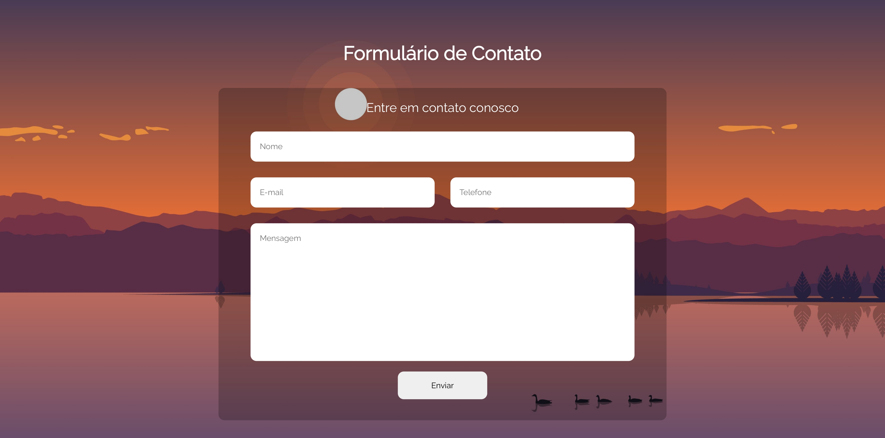

## 📝 Formulário de Contato 📝

### 📄 Resumo do Projeto 📄

Criei meu primeiro projeto utilizando JavaScript.

### 🚀 Apresentação do Projeto 🚀

<a target="_blank" href="https://www.linkedin.com/posts/milton-salgado-0630a1215_html-css-dev-activity-6943735906465943552-_VAx?utm_source=linkedin_share&utm_medium=member_desktop_web">Link para a Apresentação do Projeto<a>

### 🖼️ Prévia do Projeto 🖼️

  

### 📖 Descrição do Projeto 📖

Após iniciar JavaScript, decidi fazer um formulário simples com um botão que gera um alerta apresentando os dados inseridos.

Esse projeto marca o meu recomeço com JS. Nele, pude aplicar meus estudos de variáveis e funções para controlar valores recebidos dentro dos campos de um formulário. Além disso, a página possui responsividade e uma nova organização de pastas!

### 🛠️ Tecnologias aprendidas e utilizadas 🛠️

  
  
  

Agradeço a sua atenção e leitura deste documento!

Atenciosamente, 

Milton Salgado ⚡